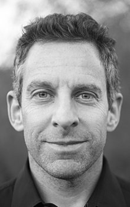

<table class="infobox vcard">
<tbody>
<tr>
<th colspan="2">

Sam Harris

</th>
</tr>
<tr>
<td colspan="2">

Harris in March 2016

</td>
</tr>
<tr>
<th scope="row">Born</th>
<td>Samuel Benjamin Harris April 9, 1967&nbsp;(age&nbsp;53) <a title="Los Angeles" href="https://en.wikipedia.org/wiki/Los_Angeles">Los Angeles, California</a>, U.S.</td>
</tr>
<tr>
<th scope="row">Occupation</th>
<td class="role">Author</td>
</tr>
<tr>
<th scope="row">Citizenship</th>
<td>United States</td>
</tr>
<tr>
<th scope="row">Education</th>
<td><a title="Bachelor of Arts" href="https://en.wikipedia.org/wiki/Bachelor_of_Arts">B.A.</a>&nbsp;in Philosophy,&nbsp;<a title="Stanford University" href="https://en.wikipedia.org/wiki/Stanford_University">Stanford University</a>&nbsp;(2000) <a class="mw-redirect" title="Ph.D." href="https://en.wikipedia.org/wiki/Ph.D.">Ph.D.</a>&nbsp;in Neuroscience,&nbsp;<a title="University of California, Los Angeles" href="https://en.wikipedia.org/wiki/University_of_California,_Los_Angeles">University of California, Los Angeles</a>&nbsp;(2009)</td>
</tr>
<tr>
<th scope="row">Genre</th>
<td class="category"><a class="mw-redirect" title="Non-fiction" href="https://en.wikipedia.org/wiki/Non-fiction">Non-fiction</a></td>
</tr>
<tr>
<th scope="row">Subject</th>
<td><a title="Neuroscience" href="https://en.wikipedia.org/wiki/Neuroscience">Neuroscience</a>,&nbsp;<a title="Philosophy" href="https://en.wikipedia.org/wiki/Philosophy">philosophy</a>,<a href="https://en.wikipedia.org/wiki/Sam_Harris#cite_note-pardi-2">[2]</a>&nbsp;<a title="Religion" href="https://en.wikipedia.org/wiki/Religion">religion</a>,&nbsp;<a title="Spirituality" href="https://en.wikipedia.org/wiki/Spirituality">spirituality</a>,&nbsp;<a title="Ethics" href="https://en.wikipedia.org/wiki/Ethics">ethics</a>,&nbsp;<a title="Politics" href="https://en.wikipedia.org/wiki/Politics">politics</a></td>
</tr>
<tr>
<th scope="row">Notable awards</th>
<td>PEN/Martha Albrand Award,&nbsp;<a title="Webby Award" href="https://en.wikipedia.org/wiki/Webby_Award">Webby Award</a></td>
</tr>
<tr>
<th scope="row">Spouse</th>
<td>

<a title="Annaka Harris" href="https://en.wikipedia.org/wiki/Annaka_Harris">Annaka Harris</a>&nbsp;(<abbr title="married">m.</abbr>&nbsp;2004)

</td>
</tr>
<tr>
<th scope="row">Children</th>
<td>2</td>
</tr>
<tr>
<th scope="row">Parents</th>
<td>Berkeley Harris <a title="Susan Harris" href="https://en.wikipedia.org/wiki/Susan_Harris">Susan Spivak</a></td>
</tr>
<tr>
<td colspan="2">
</td>
</tr>
<tr>
<th scope="row">Signature</th>
<td></td>
</tr>
<tr>
<td colspan="2">
<strong>Philosophy career</strong></td>
</tr>
<tr>
<td colspan="2">&nbsp;</td>
</tr>
<tr>
<th scope="row">Era</th>
<td class="category"><a title="Contemporary philosophy" href="https://en.wikipedia.org/wiki/Contemporary_philosophy">Contemporary philosophy</a></td>
</tr>
<tr>
<th scope="row">Region</th>
<td class="category"><a title="Western philosophy" href="https://en.wikipedia.org/wiki/Western_philosophy">Western philosophy</a></td>
</tr>
<tr>
<th scope="row"><a title="List of schools of philosophy" href="https://en.wikipedia.org/wiki/List_of_schools_of_philosophy">School</a></th>
<td class="category"><a title="New Atheism" href="https://en.wikipedia.org/wiki/New_Atheism">New Atheism</a></td>
</tr>
<tr>
<th scope="row"><a title="Thesis" href="https://en.wikipedia.org/wiki/Thesis">Thesis</a></th>
<td><a class="external text" href="https://search.proquest.com/docview/366925574/" rel="nofollow"><em>The Moral Landscape: How Science Could Determine Human Values</em></a>&nbsp;(2009)</td>
</tr>
<tr class="note">
<th scope="row">

Notable ideas

</th>
<td><a title="The Moral Landscape" href="https://en.wikipedia.org/wiki/The_Moral_Landscape">The Moral Landscape</a>,&nbsp;<a title="Science of morality" href="https://en.wikipedia.org/wiki/Science_of_morality#Overview">Ethics as a branch of science</a></td>
</tr>
<tr class="note">
<td colspan="2">

Influences

<ul>
<li class="NavHead"><a title="Bertrand Russell" href="https://en.wikipedia.org/wiki/Bertrand_Russell">Bertrand Russell</a></li>
<li class="NavHead"><a title="Daniel Dennett" href="https://en.wikipedia.org/wiki/Daniel_Dennett">Daniel Dennett</a></li>
</ul>

</td>
</tr>
<tr>
<th colspan="2">Website</th>
</tr>
<tr>
<td colspan="2"><a class="external text" href="http://samharris.org/" rel="nofollow">samharris<wbr />.org</a></td>
</tr>
</tbody>
</table>

 

<h2> Books</h2>

<ul>

                             

 <li><a target="_blank" href="https://github.com/manjunath5496/Sam-Harris-Books/blob/master/sam(1).pdf" style="text-decoration:none;">Free Will</a></li>

 <li><a target="_blank" href="https://github.com/manjunath5496/Sam-Harris-Books/blob/master/sam(2).pdf" style="text-decoration:none;">Lying</a></li>

<li><a target="_blank" href="https://github.com/manjunath5496/Sam-Harris-Books/blob/master/sam(3).pdf" style="text-decoration:none;">The Moral Landscape</a></li>
 <li><a target="_blank" href="https://github.com/manjunath5496/Sam-Harris-Books/blob/master/sam(4).pdf" style="text-decoration:none;">Letter to a Christian Nation</a></li>                              
<li><a target="_blank" href="https://github.com/manjunath5496/Sam-Harris-Books/blob/master/sam(5).pdf" style="text-decoration:none;"> Waking Up: A Guide to Spirituality Without Religion</a></li>
<li><a target="_blank" href="https://github.com/manjunath5496/Sam-Harris-Books/blob/master/sam(6).pdf" style="text-decoration:none;">The End of Faith</a></li>
 <li><a target="_blank" href="https://github.com/manjunath5496/Sam-Harris-Books/blob/master/sam(7).pdf" style="text-decoration:none;">The Four Horsemen, The Conversation: That Sparked an Atheist Revolution</a></li>

 </ul>
